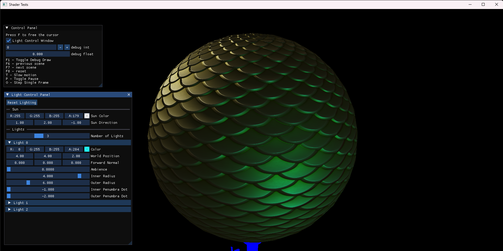
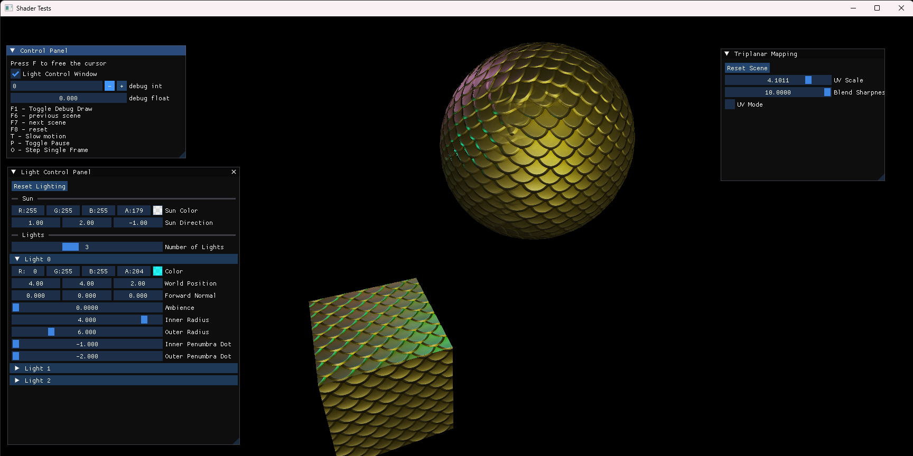
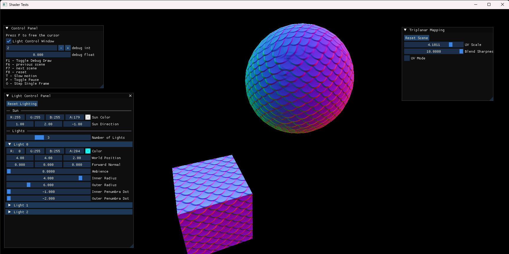
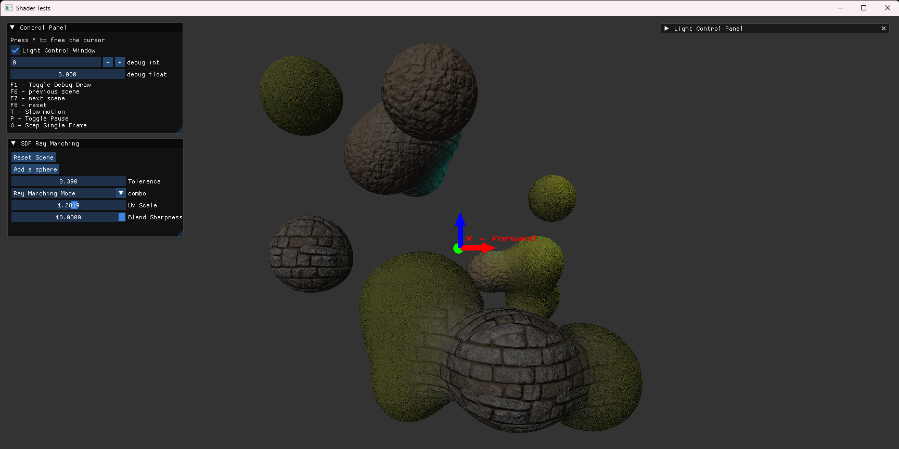

# ShaderTests

## Features
- Basic Chess Rules
- Blinn-Phong Shading
- OBJ Model load and view
- TCP/IP + IPv4 multiplayer chess game

## Gallery
> PBR with Direct Lighting  
> 

> Triplanar Mapping (PBR and World Normal) 
> 
> 

> SDF + Ray Marching + PBR
> 

## Controls
```
F - Free/Lock the cursor

F6 - previous, 
F7 - next, 
F8 - reset, 
T - Slow motion
O - Step one frame
P - Pause/Resume

Mouse and KeyBoard:
Mouse  - Aim
W / S  - Move
A / D  - Strafe
Q / E  - Elevate
Z / C  - Roll
Shift  - Sprint
~      - Open Dev Console
Escape - Exit Game
Space  - Start Game

GamePad:
Right Stick  - Aim
Left Stick   - Move
L/R Trigger  - Roll
L/R Shoulder - Elevate
A            - Sprint
Start        - Reset Camera
```

## How to run
Go to `PROJECT_NAME/Run/` and Run `PROJECT_NAME_Release_x64.exe`

## How to build
1. Clone Project
```bash
git clone --recurse-submodules https://github.com/cloud-sail/ChessDX.git
```
2. Open Solution `PROJECT_NAME.sln` file
- In Project Property Pages
  - Debugging->Command: `$(TargetFileName)`
  - Debugging->Working Directory: `$(SolutionDir)Run/`
